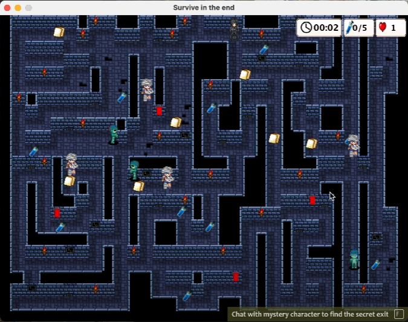
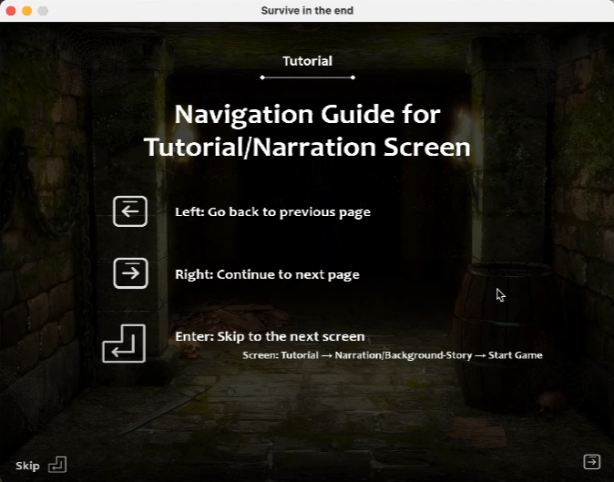

# 2D Maze Game in Java - Survive in the end
Our game, Survive in the End, is an arcade style pseudo 3D game. The game is based on a zombie apocalypse horror story where the survivors include good survivors, bad survivors. and the main player. While the good and bad survivors have the same visuals, the main player will lose HP when coming in contact with the bad survivors. On the contrary, the good survivor will increase the main player’s HP when in contact. Throughout the maze, there are numerous vaccines scattered for the player to collect. The player’s objective is to collect the required number of vaccines and find the good survivor who will open the exit door for the player to exit the maze. The required number of vaccines depends on the difficulty level chosen by the player.

## Preview




## Demo Video
Tutorial/Demo : https://youtu.be/aygcDsqt94s
<br>
How to run JAR file: https://youtu.be/jWbqj0YPi3I


## Technology
* Java
* intelliJ IDE with JDK
* GitLab
* Maven
* Junit


## Installation
### Build
Run the following commands to build all the class located in the directory ~/Code/src/main/java/.
```
$ mvn clean
$ mvn install
$ mvn build
```

Run the following command to start the game in the directory ~/Code/target
```
$ java -cp Survive_in_the_end-1.0-jar-with-dependencies.jar Main
```


### JAR files and executables
After the maven commands are run, the following jar files will be created in the directory: ~/Code/target/.
* Survive_in_the_end-1.0 -> Jar files with game classes
* Survive_in_the_end-1.0-jar-with-dependency -> Jar files with classes and their dependency
* Survive_in_the_end-1.0-javadoc -> Jar files with javadoc comments in html

### Run
Method 1: Run the Java class file "Main.class" located in the directory: ~/Code/src/main/java/.
<br>
Method 2: Run the following command to start the game in the directory ~/Code/target
```
$ java -cp Survive_in_the_end-1.0-jar-with-dependencies.jar Main
```


## Testing
Set up IDE to run all files in the directory: ~/Code/src/test/java/.

---
CMPT276 Introduction to Software Engineering - Group Project (Risa.K, Rongsheng.Q, Anika S, Sibei.Z)
